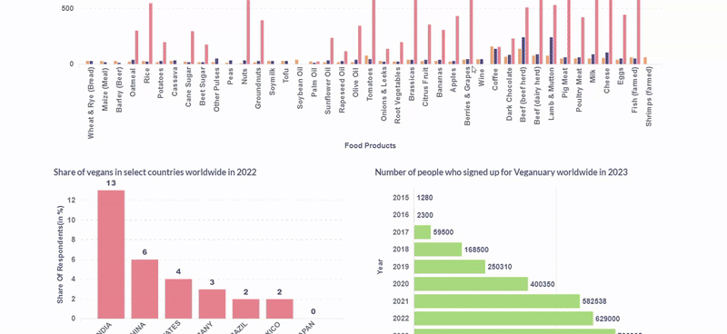

# 🥗 Ecofriendly Eating – The Vegan Way

A data-driven exploration into the **rise of veganism**, changing consumer behavior, and regional trends. This project uses **Metabase**, an open-source BI tool, for visualization and interactive dashboards.

---
## 🎥 Dashboard Preview

---
## 📊 Project Overview

In this project, I used **Metabase** for:
- Tracking the global **growth of veganism**
- Understanding **patterns and behaviors** of vegan consumers
- Visualizing data using **custom geo-maps** for both **India** and **the World**

The goal is to understand the **eco-friendly food movement** through insightful, interactive visualizations.

---

## 📍 Dashboard Access

🖥️ **Metabase Dashboard Link**  
👉 [View Dashboard](http://localhost:3000/public/dashboard/c913056a-a418-4065-9288-9a9b0ad19ce1)  
> *(Note: You need to host this on your local/server instance of Metabase to view the dashboard.)*

---

## 🗺️ Custom Map Links

- 🌍 **Continents Map (GeoJSON)**  
  [Download Continents GeoJSON](https://gist.githubusercontent.com/cmunns/76fb72646a68202e6bde/raw/8f954b3ca01835bee4af9ae50dfe73eb6ab88fca/continents.json)

- 🇮🇳 **India States Map (GeoJSON)**  
  [Download India GeoJSON](https://raw.githubusercontent.com/Anusha26399/India-map/main/india_state_geo.json)

These maps were integrated into Metabase for **region-specific visualizations**.

---

## 🔧 Tools & Technologies

- **Metabase** – Interactive BI dashboard
- **Custom GeoJSON Maps** – For region-based analysis
- **CSV** – Data source
- **Data cleaning & prep** 

---

## 📈 Insights Explored

- Rise in vegan-related Google searches over time
- Distribution of vegan product sales globally
- Veganism growth trends in Indian states

